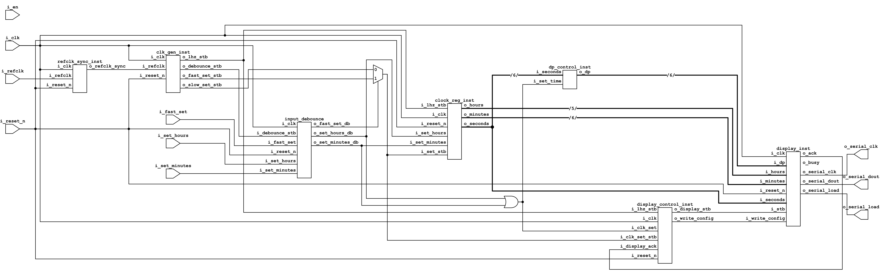
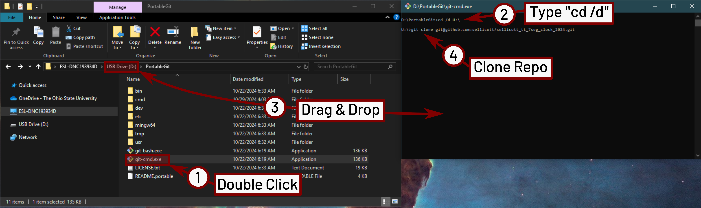
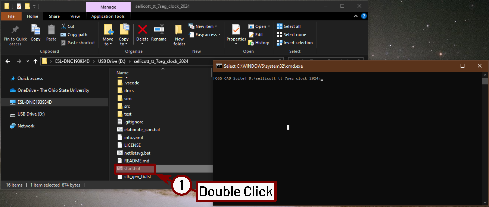
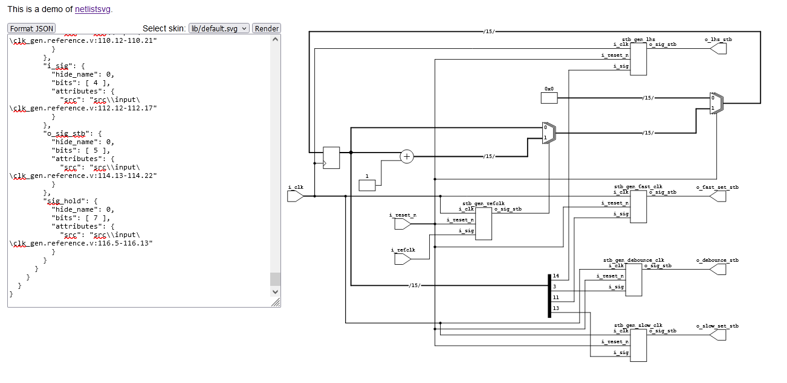

   

# 7-Segment LED Desk Clock
> [!NOTE]
> Example Project for Fall 2024 Columbus SSCS/CAS Tiny Tapeout Workshop
> This is a demonstration Tiny Tapeout project for the workshop series held by the
> [Columbus chapter of IEEE SSCS/CAS](https://r2.ieee.org/columbus-ssccas/blog/2024/01/14/tiny-tapeout-workshop-announcement/).

## Using this Template

The goal of this project is to demonstrate the Tiny Tapeout flow starting from
a Verilog design to build a GDS file for manufacturing. 
- [Read the project documentation](docs/info.md)

While most modules for the project are provided, several modules are left unfinished
(as an exercise to the reader). The unfinished modules are:
[clk_gen_template.v](src/input/clk_gen_template.v), and
[clock_register_template.v](src/core/clock_register_template.v).

Additionally, the testbench for `clk_gen_template.v` is incomplete
[clk_gen_tb.v](test/clk_gen_tb.v).

> [!NOTE]
> The [info.yaml](info.yaml) file points to the wrong filename for both of these files, that also
> needs to be adjusted before all tests complete successfully.

## Project Description
Simple digital clock, displays hours, minutes, and seconds in a 24h format. The goal for the project is a simple demonstration of Verilog concepts while 
producing an interesting final project. The design is broken down into several components that should be filled in by workshop attendees.
These are tested using the provided testbenches for functionality, then assembled into the final design.

Simple digital clock, displays hours, minutes, and seconds in either a 24h format. Since there are not enough output pins to directly drive a 6x 7-segment displays, the data is shifted out over SPI to a MAX7219 in 7-segment mode. The time can be set using the hours_set and minutes_set inputs. If set_fast is high, then the the hours or minutes will be incremented at a rate of 5Hz, otherwise it will be set at a rate of 2Hz. Note that when setting either the minutes, rolling-over will not affect the hours setting. If both hours_set and minutes_set are pressed at the same time the seconds will be cleared to zero.

A block diagram of the design is shown below.



# Local Simulation

This project can be locally simulated (including on Windows) using the [OSS-CAD-Suite](https://github.com/YosysHQ/oss-cad-suite-build/releases) from YosysHQ.
For instructions on setting up the tools, see [Open Source IC Resources](https://r2.ieee.org/columbus-ssccas/resources/open-source-ic-tools/) on the Columbus SSCS/CAS website.

> [!CAUTION]
> OSS-CAD-Suite must be installed to a path without spaces

## Clone the Git Repository
> [!NOTE]
> The following instructions are provided in order to use PortableGit.
> If already familiar with git, proceed normally.

Once the tools are setup, clone this repository to the same directory that the tools are located.


Now that the tools are installed and this repository is cloned, the environment can be opened by running the [start.bat](start.bat) script.



## Testbench Simulation

Now, the various modules in the project can be simulated individually.
The following instructions describe the commands to simulate each included testbench. Run them by copy-pasting into the OSS CAD Suite terminal 
(setup by running [start.bat](start.bat))

> [!NOTE]
> The [start.bat](start.bat) script assumes that portable git is being used, and is installed in the same directory as `oss-cad-suite`. It also assumes that the git repository was cloned in the same folder as `oss-cad-suite`.
> If this is not the case, modify the script accordingly.

In general, testbenches can be run with the following commands
```batch
iverilog -o sim\<testbench>.vvp test\<testbench>.v src\<verilog file 1>.v src\<verilog file 2>.v ...
vvp sim\<testbench>.vvp -fst
```
Then, assuming there were no errors during simulation, the result can be displayed using
```
gtkwave <testbench>.fst
```

### Functional Simulation Commands for Key Testbenches 
While (almost) all of the modules in the project have individual testbenches that can be run using
the commands described above, the following three testbenches are the the ones that will be focused
on at the workshop. Therefore, the commands to build the testbenches are provided for easy access
using the Windows tools.

* [clk_gen_tb](test/clk_gen_tb.v):
  ```batch
  iverilog -o sim\clk_gen_tb.vvp test\clk_gen_tb.v src\input\clk_gen.v
  vvp sim\clk_gen_tb.vvp -fst
  ```
* [clock_register_tb](test/clock_register_tb.v):
  ```batch
  iverilog -o sim\clock_register_tb.vvp test\clock_register_tb.v src\core\clock_register.v src\input\button_debounce.v src\input\refclk_sync.v src\input\clk_gen.v
  vvp sim\clock_register_tb.vvp -fst
  ```
* [tiny_tapeout_tb](test/tiny_tapeout_tb.v):
  ```batch
  iverilog -o sim\tiny_tapeout_tb.vvp src\tiny_tapeout_tb.v src\tt_um_digital_clock_example.v src\clock_wrapper.v src\input\refclk_sync.v src\input\clk_gen.v src\input\button_debounce.v src\core\clock_register.v src\core\decimal_point_controller.v src\core\display_controller.v src\core\output_wrapper.v src\output\clock_to_bcd.v src\output\binary_to_bcd.v src\output\max7219_settings.v src\output\max7219.v src\test\bcd_to_7seg.v src\test\test_max7219_moc.v src\test\test_7seg_to_bcd.v
  vvp sim\tiny_tapeout_tb.vvp -fst
  ```

### Show Elaborated Block Diagram
It is useful to see what the elaboration/synthesis tool does with the
design. We can run `Yosys` (using a helper script) on the design to
generate a block diagram. In general run:

```batch
elaborate_json.bat <top_module> <list of input files>
```
This will copy the design (in JSON format) to your clipboard (assuming no errors). Then paste the output into [netlistsvg](https://neilturley.dev/netlistsvg/)

The result should be something like this:



* clk_gen.v
  ```batch
  elaborate_json.bat clk_gen src\input\clk_gen.v
  ```

## What is Tiny Tapeout?

Tiny Tapeout is an educational project that aims to make it easier and cheaper than ever to get your digital and analog designs manufactured on a real chip.

To learn more and get started, visit https://tinytapeout.com.

## Set up your Verilog project

1. Add your Verilog files to the `src` folder.
2. Edit the [info.yaml](info.yaml) and update information about your project, paying special attention to the `source_files` and `top_module` properties. If you are upgrading an existing Tiny Tapeout project, check out our [online info.yaml migration tool](https://tinytapeout.github.io/tt-yaml-upgrade-tool/).
3. Edit [docs/info.md](docs/info.md) and add a description of your project.
4. Adapt the testbench to your design. See [test/README.md](test/README.md) for more information.

The GitHub action will automatically build the ASIC files using [OpenLane](https://www.zerotoasiccourse.com/terminology/openlane/).

## Enable GitHub actions to build the results page

- [Enabling GitHub Pages](https://tinytapeout.com/faq/#my-github-action-is-failing-on-the-pages-part)

## Resources

- [FAQ](https://tinytapeout.com/faq/)
- [Digital design lessons](https://tinytapeout.com/digital_design/)
- [Learn how semiconductors work](https://tinytapeout.com/siliwiz/)
- [Join the community](https://tinytapeout.com/discord)
- [Build your design locally](https://www.tinytapeout.com/guides/local-hardening/)

## What next?

- [Submit your design to the next shuttle](https://app.tinytapeout.com/).
- Edit [this README](README.md) and explain your design, how it works, and how to test it.
- Share your project on your social network of choice:
  - LinkedIn [#tinytapeout](https://www.linkedin.com/search/results/content/?keywords=%23tinytapeout) [@TinyTapeout](https://www.linkedin.com/company/100708654/)
  - Mastodon [#tinytapeout](https://chaos.social/tags/tinytapeout) [@matthewvenn](https://chaos.social/@matthewvenn)
  - X (formerly Twitter) [#tinytapeout](https://twitter.com/hashtag/tinytapeout) [@tinytapeout](https://twitter.com/tinytapeout)
